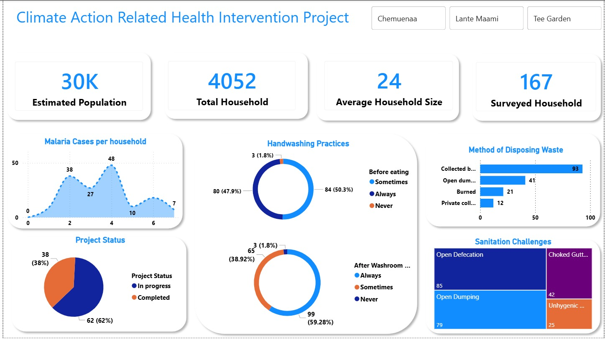
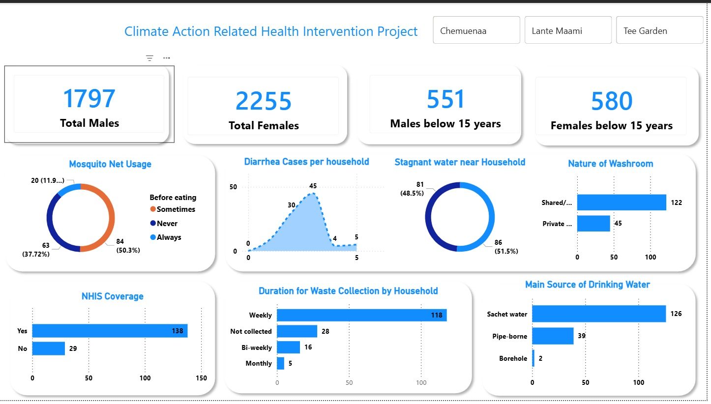
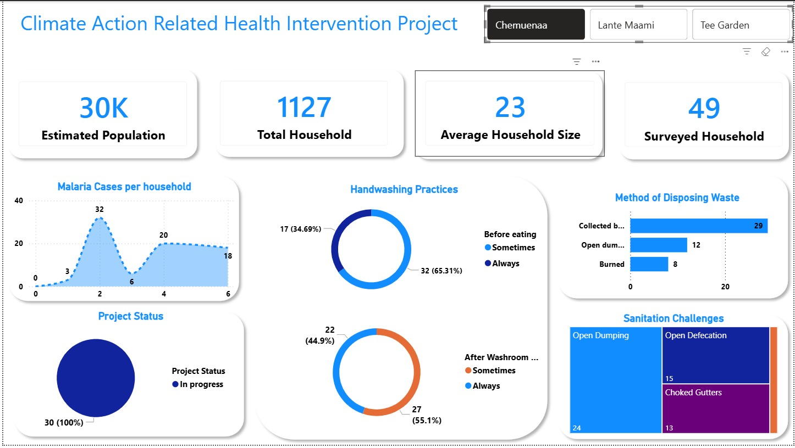
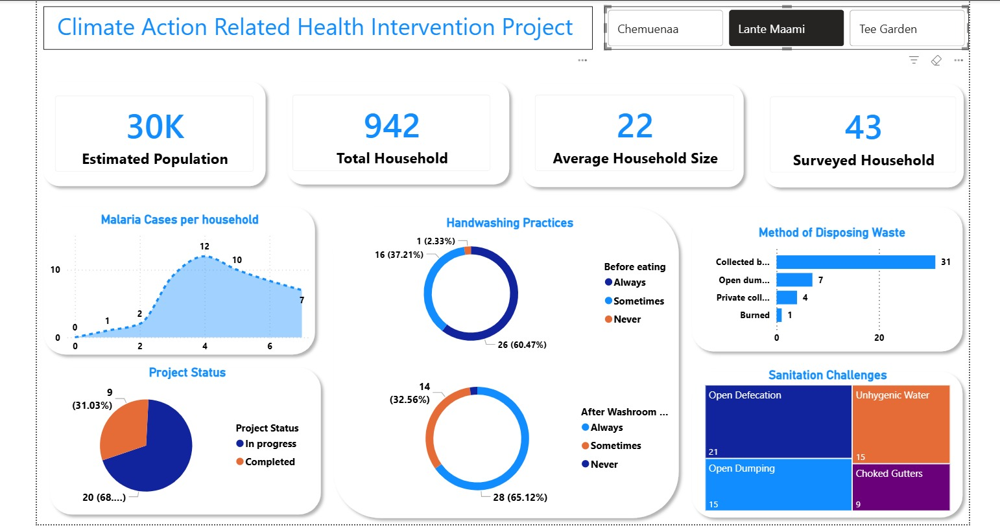
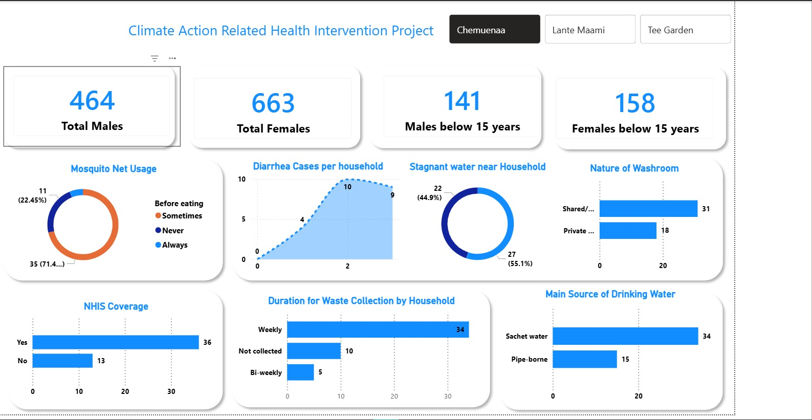
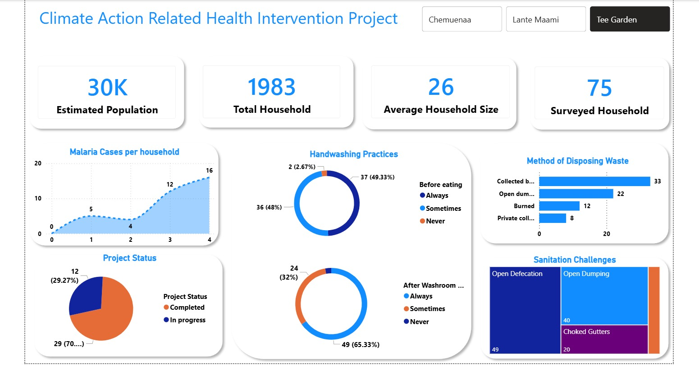
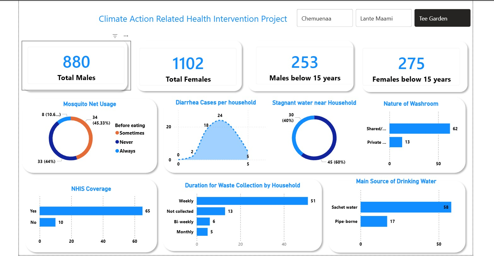
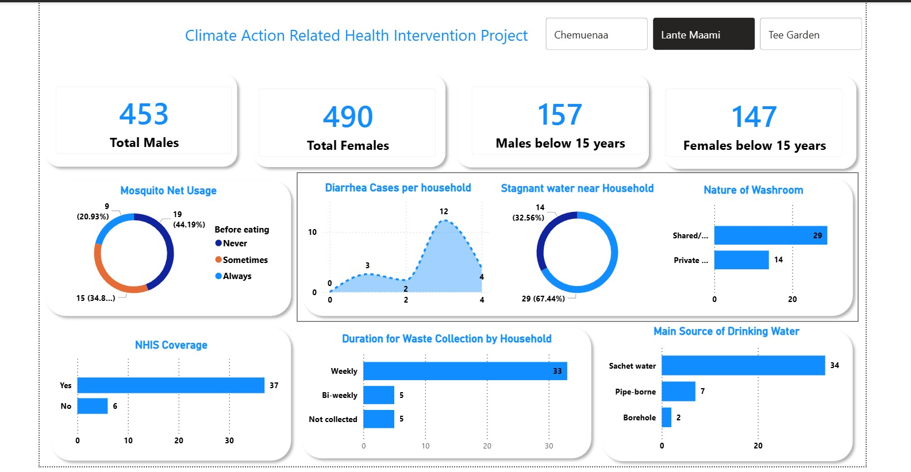

# Prudential Life (PruClimate) Malaria & Cholera Intervention — M&E Dashboard

**United Way Ghana | Chorkor, Accra — Chemuenaa, Lante Maami & Tee Garden communities**

> Monitoring & Evaluation dashboard built from household and school survey data collected for a climate-linked health intervention (malaria and cholera/diarrheal disease prevention, WASH, and sanitation infrastructure) implemented by United Way Ghana with support from Prudential Life Ghana / PruClimate.

`Power BI` · `Excel` · `Survey Data Analysis` · `M&E` · `Data Cleaning` · `Dashboard Design`

---

## Table of Contents

1. [Executive Summary](#executive-summary)
2. [Project Background](#project-background)
3. [My Role & Process](#my-role--process)
4. [Communities & Sample Coverage](#communities--sample-coverage)
5. [Dashboard Screenshots](#dashboard-screenshots)
6. [Key Findings — All Communities](#key-findings--all-communities)
7. [Key Findings by Community](#key-findings-by-community)
8. [School-Level Findings](#school-level-findings-tee-garden-n21)
9. [Data Quality Notes & Limitations](#data-quality-notes--limitations)
10. [Recommendations](#recommendations)
11. [M&E Methodology](#me-methodology)
12. [Repository Structure](#repository-structure)
13. [About Me](#about-me)

---

## Executive Summary

Three Chorkor communities — Tee Garden, Chemuenaa, and Lante Maami — were surveyed for a Prudential Life / PruClimate-supported intervention combining toilet construction, waste management, malaria prevention, and hygiene promotion. 167 households and 21 schools were surveyed. I helped turn that raw survey data into a set of Power BI dashboards the project team could filter by community, and used it to identify where the intervention is working (community perception, malaria and diarrheal trends) and where it isn't yet (toilet-completion tracking, waste bin coverage, water treatment) — summarized in the findings and recommendations below.

---

## Project Background

Chorkor is a densely populated coastal community in Accra facing recurring sanitation and health challenges — open defecation, choked gutters, stagnant water, and limited waste collection — that contribute to malaria and diarrheal/cholera disease burden. The intervention covered in this dashboard responded to that by combining:

- **Toilet facility construction** across three sub-communities
- **Waste management support** (bins, collection)
- **Malaria prevention** (mosquito nets, household education)
- **Hygiene promotion** (handwashing, water treatment awareness)

The link to *climate action* is that flooding, stagnant water, and waste accumulation in coastal, low-lying communities like Chorkor are worsened by climate-related rainfall and sea-level pressures — which in turn drive mosquito breeding and waterborne disease risk. Monitoring toilet access, waste handling, and disease trends is therefore both a sanitation and a climate-resilience indicator.

---

## My Role & Process

I supported the M&E workstream for this project, focused on turning field survey data into something the project team could actually use for decision-making:

1. **Reviewed the raw survey exports** — a household-level survey (167 responses across three community sheets) and a school-level survey (21 responses) — both collected through form-based data collection and exported to Excel.
2. **Checked data consistency** across the three community sheets (column structure, response categories, missing values) before combining them for analysis.
3. **Defined the indicators** that mattered for this intervention: sanitation access, toilet construction attribution, waste management, water treatment, malaria/diarrheal trend, handwashing behavior, NHIS coverage, and satisfaction — see the [data collection framework](documentation/data-collection-framework.md) for the full variable list.
4. **Built Power BI dashboards** with a community-level filter (Chemuenaa / Lante Maami / Tee Garden), so the same set of KPIs and charts can be viewed in aggregate or drilled into a single community — see [screenshots below](#dashboard-screenshots).
5. **Summarized findings and flagged data gaps** (in particular, incomplete toilet-status tracking — see [Data Quality Notes](#data-quality-notes--limitations)) for follow-up by the project and field teams.

---

## Communities & Sample Coverage

| Community | Households Surveyed | Share of Sample |
|---|---:|---:|
| Tee Garden | 75 | 44.9% |
| Chemuenaa | 49 | 29.3% |
| Lante Maami | 43 | 25.7% |
| **Total** | **167** | **100%** |

A separate school-level survey was also administered — 21 responses, all from schools in the Tee Garden area — covering enrollment, toilet facilities, handwashing stations, and malaria/diarrheal absenteeism.

---

## Dashboard Screenshots

### 1. Project Overview — All Communities


KPI summary (estimated population, total households, average household size, households surveyed) alongside malaria case distribution, handwashing practices, waste disposal methods, project status, and top sanitation challenges (open defecation, open dumping, choked gutters, unhygienic water) across all three communities. **What to look at:** the Project Status donut (62% "in progress" at this aggregate view) and the Sanitation Challenges treemap, which is dominated by open defecation and open dumping.

### 2. Demographics & WASH — All Communities


Gender and age breakdown of surveyed households, mosquito net usage, diarrhea case trends, stagnant water presence near homes, toilet type (shared vs. private), NHIS coverage, waste collection frequency, and main drinking water source. **What to look at:** nearly half of households (48.5%) report stagnant water near their home, and shared/public toilets (122) far outnumber private ones (45).

### 3. Chemuenaa — Project Overview


Same KPI/chart layout as screenshot 1, filtered to Chemuenaa's 49 surveyed households. Notably, this community shows 0% "completed" project status — see [Key Findings by Community](#key-findings-by-community).

### 4. Lante Maami — Project Overview


Filtered to Lante Maami's 43 households. Like Chemuenaa, no households here report a "completed" toilet status.

### 5. Chemuenaa — Demographics & WASH


### 6. Tee Garden — Project Overview


Filtered to Tee Garden's 75 households — the only community where "completed" project status appears (20% of households), and where "open defecation" is the single largest reported sanitation challenge.

### 7. Tee Garden — Demographics & WASH


### 8. Lante Maami — Demographics & WASH


*Screenshots 3–8 use the same underlying dashboard filtered to a single community, so progress and gaps can be compared community-by-community rather than only in aggregate.*

---

## Key Findings — All Communities

**Sanitation & toilet access**
- 89.8% of households (150/167) reported having access to a toilet facility; 17 did not.
- Only 31 of 159 households who answered reported that their toilet was built through the Prudential project — most existing toilet access predates the intervention (107 said "no," 28 said "not applicable").
- **Project (toilet construction) status was recorded as "not available" for 92 of 167 households (55%)**, with 60 "in progress" and only 15 "completed." This is the single clearest data/tracking gap — see [Recommendations](#recommendations).

**Waste management**
- Only 31% of households (52/167) reported having access to a waste bin. Open dumping and open defecation were the top recurring sanitation challenges flagged across all three communities.

**Malaria**
- 53% of households (88/167) reported malaria cases had reduced vs. the previous year; 40% were "not sure," and only 4 households reported an increase — broadly positive, though the high "not sure" share suggests limited household-level trend awareness.

**Diarrheal / cholera-related illness**
- 45% (75/167) reported diarrheal cases had reduced year-on-year; 49% were "not sure."
- Only 35% of households (58/167) treat their drinking water before use — a residual risk area given the project's cholera-prevention focus.

**Community perception**
- 97% of households (160/165) believe the project has improved sanitation in their community.
- Satisfaction was largely positive: 55% satisfied, 16% very satisfied, 29% neutral, 1 household dissatisfied.

---

## Key Findings by Community

| Indicator | Tee Garden (n=75) | Chemuenaa (n=49) | Lante Maami (n=43) |
|---|---:|---:|---:|
| Toilet access | 94.7% | 95.9% | 74.4% |
| Toilet built through project | 40.0% | 0% | 2.3% |
| Project status: Completed | 20.0% | 0% | 0% |
| Project status: In progress | 33.3% | 40.8% | 34.9% |
| Project status: Not available | 46.7% | 59.2% | 65.1% |
| Waste bin access | 13.3% | 38.8% | 53.5% |
| Treats drinking water | 28.0% | 59.2% | 18.6% |
| Malaria cases reduced vs. last year | 36.0% | 59.2% | 74.4% |
| Diarrheal cases reduced vs. last year | 36.0% | 38.8% | 67.4% |
| Believes project improved sanitation | 97.3% | 93.9% | 95.3% |
| Satisfied or very satisfied | 77.3% | 73.5% | 55.8% |
| NHIS coverage | 86.7% | 73.5% | 86.0% |

A few patterns stand out:

- **Tee Garden is the only community with any "completed" toilet status (20%)** and the only one where a meaningful share of toilets (40%) are attributed to the project — but it also has the lowest waste bin coverage (13.3%) and lowest water-treatment rate (28%).
- **Chemuenaa and Lante Maami report zero "completed" toilets**, with 59–65% of households recorded as "not available" — construction here appears to lag Tee Garden.
- **Lante Maami has the lowest toilet access overall (74.4%)** but the strongest malaria and diarrheal improvement trends (74.4% and 67.4% reduced) and the lowest water-treatment rate (18.6%) — a combination worth flagging for follow-up, since improving trends don't necessarily mean underlying risk factors have gone away.
- **Satisfaction is highest in Tee Garden (77.3%) and lowest in Lante Maami (55.8%)**, broadly consistent with where construction has progressed furthest.

---

## School-Level Findings (Tee Garden, n=21)

- 15 of 20 responding schools said the project had improved student attendance; 13 of 20 said malaria-related absenteeism had reduced compared to the previous year.
- Soap availability at handwashing stations was inconsistent — several schools reported soap was only "sometimes" available rather than always.
- All 21 school responses came from the Tee Garden area — no school-level data was collected in Chemuenaa or Lante Maami.

---

## Data Quality Notes & Limitations

- Figures reflect self-reported household and school survey responses at the time of data collection, not independently verified facility or clinical records.
- "Not sure" responses on malaria/diarrheal trends were kept as their own category rather than excluded, since a high "not sure" share is itself informative about gaps in household-level monitoring.
- The "open defecation" question appears to have been answered by some households that also reported having toilet access, so it's read here as a general prevalence indicator rather than strictly limited to households without a toilet.
- The school-level sample (21 responses, one community only) is too small, and too geographically narrow, to generalize across all three communities.
- Dashboard KPI cards for "Estimated Population" and "Total Household" reflect fixed project-level reference figures rather than figures derived from the surveyed sample, and do not change when a community filter is applied.

---

## Recommendations

1. **Close the project-status data gap.** Over half of households (55%) have no recorded toilet construction status, rising to 65% in Lante Maami. Standardize a completion tracker (location, stage, outstanding work, responsible party, follow-up date) so this can't remain "not available."
2. **Prioritize waste bin distribution in Tee Garden.** At 13.3% coverage — the lowest of the three communities despite having the most completed toilets — this is the clearest mismatch between infrastructure progress and waste management support.
3. **Pair water-treatment promotion with cholera-prevention messaging, especially in Lante Maami**, where only 18.6% of households treat drinking water despite lower toilet access.
4. **Clarify toilet attribution and ownership**, particularly in Chemuenaa and Lante Maami where almost no toilets are attributed to the project — confirm this is understood correctly by field teams so project impact isn't over- or under-stated in reporting.
5. **Extend school-level monitoring to Chemuenaa and Lante Maami.** The school survey currently only covers Tee Garden; comparable data from the other two communities would give a fuller picture of the intervention's reach on children.
6. **Improve household-level trend awareness**, especially in Tee Garden and Chemuenaa where 40–63% of households answered "not sure" on malaria/diarrheal trends — simple take-home reference materials or community health worker follow-up visits could improve the quality of this self-reported data over time.

---

## M&E Methodology

- **Data collection:** Structured household and school survey forms covering demographics, sanitation access, WASH practices, malaria and diarrheal case history, and project satisfaction.
- **Data consolidation:** Responses organized by community into a shared, comparable dataset.
- **Data verification:** Cross-checking of figures across community sheets and dashboard views to catch inconsistencies before reporting.
- **Visualization:** Interactive Power BI dashboards with community-level filtering, so the same indicators can be viewed in aggregate or drilled into a single community.
- **Reporting:** Indicators summarized to help the project team identify implementation gaps (toilet completion status, waste bin coverage, water treatment) and prioritize follow-up — see the [data collection framework](documentation/data-collection-framework.md) for the full variable-by-variable breakdown.

---

## Repository Structure

```text
pruclimate-me-dashboard/
│
├── README.md
├── images/
│   ├── dashboard-01-overview-all-communities.jpeg
│   ├── dashboard-02-demographics-wash-all-communities.jpeg
│   ├── dashboard-03-chemuenaa-overview.jpeg
│   ├── dashboard-04-lante-maami-overview.jpeg
│   ├── dashboard-05-chemuenaa-demographics.jpeg
│   ├── dashboard-06-tee-garden-overview.jpeg
│   ├── dashboard-07-tee-garden-demographics.jpeg
│   └── dashboard-08-lante-maami-demographics.jpeg
└── documentation/
    └── data-collection-framework.md
```

> **Note on data privacy:** Raw survey response files are not included in this repository, since even without names they contain household-level detail. Only the anonymized, aggregated figures summarized in this README should be published publicly.

---

## About Me

*[Add 2–3 sentences here: your name, your background, and a link to your other data projects or LinkedIn.]*

